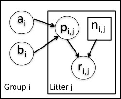

```{r chunksetup, include=FALSE} 
# include any code here you don't want to show up in the document,
# e.g. package and dataset loading
library(methods)  # otherwise new() not being found 
library(nimble)
```


# The BUGS language

NIMBLE uses (almost) the same language as BUGS and JAGS (aka the "BUGS language") for specifying statistical models. Apart from this use of a common model language, BUGS, JAGS and NIMBLE are completely separate implementations.

The BUGS language is described in detail in the NIMBLE manual and in the [relevant section of the BUGS manual](http://www.openbugs.net/Manuals/ModelSpecification.html). 

### Stochastic declarations

  - `x ~ dgamma(shape, scale)` (`x` follows a gamma distribution with parameters `shape` and `scale`)

### Deterministic declarations

  - `y <- 2 * x`

### For loops and vectorized computations

```
for(i in 1:10) {
   lambda[i] <- exp(mu[i])
   y[i] ~ dpois(lambda[i])
}
```

In NIMBLE only, vectorized deterministic (but not stochastic) declarations:

```
lambda[1:10] <- exp(mu[1:10])
```

# Classic BUGS examples

There are lots of example models originally provided by the BUGS project:

  - Included in NIMBLE (*classic-bugs* directory) or found here on the [JAGS website](https://sourceforge.net/projects/mcmc-jags/files/Examples/).
  - Information provided here: [Volume 1](http://www.mrc-bsu.cam.ac.uk/wp-content/uploads/WinBUGS_Vol1.pdf), [Volume 2](http://www.mrc-bsu.cam.ac.uk/wp-content/uploads/WinBUGS_Vol2.pdf), and [Volume 3](http://www.mrc-bsu.cam.ac.uk/wp-content/uploads/WinBUGS_Vol3.pdf) of the WinBUGS example manuals.

# NIMBLE's dialect of BUGS

   - The BUGS syntax used in NIMBLE has minor differences from that used in WinBUGS, OpenBUGS and/or JAGS. We'll see some of this as we go along.
   - Also described in Section 5 of the [NIMBLE Users Manual](https://r-nimble.org/html_manual/cha-writing-models.html) and in this [blog post](https://r-nimble.org/quick-guide-for-converting-from-jags-or-bugs-to-nimble).

# A basic example


We'll use the *litters* model example from the original BUGS examples, available with NIMBLE in the *classic-bugs/vol1/litters* directory of the installed package (call ```searchpaths()``` after loading the NIMBLE package to find where this directory is). The data set describes the survival rates of rat pups in an experiment.

<center></center>

Here's the original litters model.

 - There are ```G=2``` groups of rat litters, with ```N=16```  litters (i.e., mothers) in each group, and a variable number of pups in each litter.
 - Survival of the pups in a litter is governed by a survival probability for each litter, ```p[i,j]```.
 - The probabilities for the litters within a group are considered to come from a common distribution, thereby borrowing strength across the litters in a group.
 - The common distributions are $p_{1,j} \sim \mbox{Beta}(a_1, b_1)$ for group 1 and $p_{2,j} \sim \mbox{Beta}(a_, b_2)$ for group 2.

# Specifying the BUGS code for a model

Here we specify the litters model code directly in R. We can walk through some of details via the comments in the BUGS code.

```{r, model-code}
library(nimble)
littersCode <- nimbleCode({
  for (i in 1:G) {
     for (j in 1:N) {
     	# Likelihood (data model)
        r[i,j] ~ dbin(p[i,j], n[i,j])
	# Latent process (random effects)
        p[i,j] ~ dbeta(a[i], b[i]) 
     }
     # Priors for hyperparameters
     # Such gamma priors are not generally recommended, but
     # these are the priors from the original example.
     a[i] ~ dgamma(1, .001)
     b[i] ~ dgamma(1, .001)
   }
})
```

